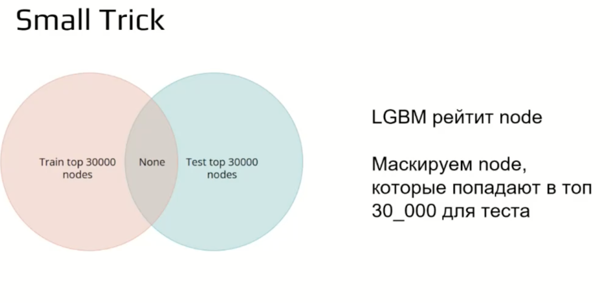
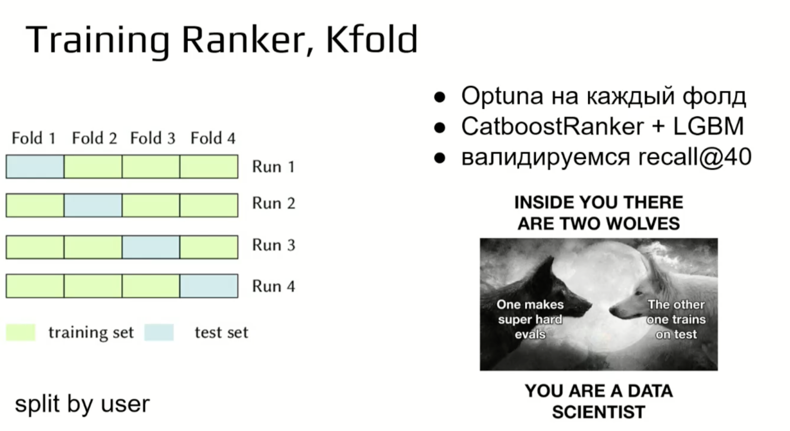

# avito-cup-2025-pers-recs
## Инфо
- Страница соревнования: https://ods.ai/competitions/avitotechmlchallenge2025
- Итоговое место на private: 35

## Описание подходов и опробованных моделей
Что пробовал:
1. Baseline - ALS на кликах - P@K ~0.14
2. Двуступенчатая модель, первый слой ALS 200 кандидатов, второй слой CatboostClassifier.
3. Добавление фичей
    1. Обработка словарей c атрибутами, собирание топ-20 самых встречающихся среди товаров фичей, среднее по node. Главная проблема - переполнение памяти при большем числе выбранных фичей
    2. Текстовые фичи обрабатывались похожим образом, брал среднее по векторам айтемов, входящих в node.
    3. Остальные фичи сложно сагрегировать, так как они принадлежат айтему и являются id, брать моду или среднее по локации, напирмер, смысла никакого не имеет.
4. Двуступенчатая модель, первый слой ALS 200 кандидатов, второй слой CatboostClassifier + фичи - P@K ~0.16
5. Добавление кандидатов из других моделей (по 40 от каждой):
    1. BM25 p@k на валидации ~ 0.09
    2. ANN индекс на annoy, выделение топ близких товаров к тем, что покупал user p@k на валидации ~ 0.06.
6. Двуступенчатая модель, первый слой ALS 100, BM25 40, ANN 40 кандидатов, второй слой CatboostClassifier + фичи - P@K ~0.17
7. Финальное рещение - Двуступенчатая модель, первый слой ALS 100, BM25 40, ANN 40 кандидатов, второй слой CatboostRanker(RMSE) + фичи - P@K ~0.175

Что хотелось, но не получилось:
1. DSSM, но не влезло по памяти в kaggle ноутбуке. Мог бы сделать разделение на батчи, но на это не хватило времени
2. Нейронная сеть в качестве 2 уровня. Пробовал, но не одна архитектура не показала лучшего качества по сравнению с catboost.
3. LightFM с параметрами, но он почему то показал вообще отвратительное качество
4. Пробовал BERT4Rec, но он тоже не влез по памяти.

## Разбор полетов и подходы, которые применяли победители и призеры:
### Решение на 1м месте
- Обучение 1 шага не на всех нодах, а на 30к
- Архитектура:

- Генерации кандидатов:

- Добавление explicit фитбека через доавление фич к LAE

- фичи во второй части модели:

- маска для node которые не видела модель

- обучение ранкера 

### Решение на 2м месте

- can gen
    - какое то мега сложное решение

- Фичи для ранкера 

### Решение на 3м месте
- can gen
    - ALS, LightFM
    - Совстречаемости
    - SASRec, BERT4Rec
    - Топ популярных
- Фичи для ранкера

- Ранкеры

## Идеи для чтения дальше:
1) Статьи про SASRec и Bert4Rec https://habr.com/ru/articles/835380/
2) LAE https://arxiv.org/pdf/1905.03375
3) Рекомендации Авито:

4) https://habr.com/ru/articles/728802/

## ИТОГ:
- Делать больше фичей, будет норм результат даже с обычными моделями
- Предсказывать нужно не обязательно все айтемы для упрощения жизни